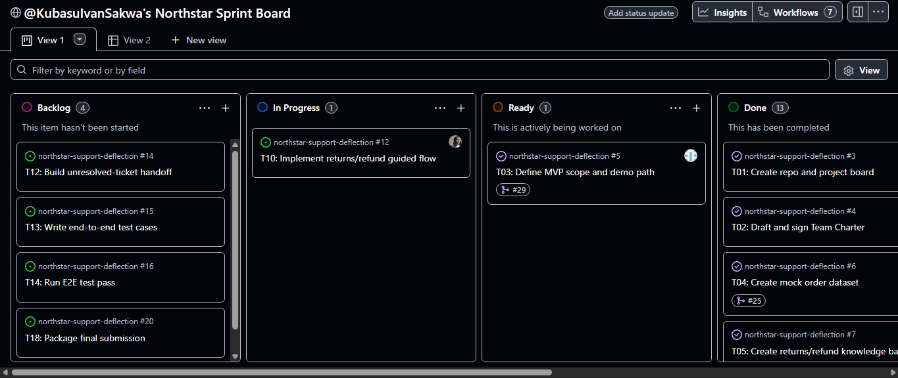

# Final Submission - Northstar Support Deflection MVP

## 1. Prototype Link
- https://northstar-support-deflection-weld.vercel.app/

## 2. Project Board Evidence
- **Board Link:** [https://github.com/users/KubasuIvanSakwa/projects/4/views/2]
- **Board Screenshots:** 

## 3. Core Documentation
- **Team Charter:** [https://docs.google.com/document/d/1ZT5Fivbg1d2ENDfooiXHvsLVz3kb7vpd/edit?rtpof=true]
- **Go-Live Readiness Note:** [https://github.com/KubasuIvanSakwa/northstar-support-deflection/blob/main/docs/go-live-readiness-note.md]

## 4. Audit Trail
- **Audit Log Export:** [https://github.com/KubasuIvanSakwa/northstar-support-deflection/blob/main/audit/commit-log.csv]
- **Mid-Sprint Snapshot:** [[Link to /audit/mid-sprint-snapshot.md](https://github.com/KubasuIvanSakwa/northstar-support-deflection/blob/main/audit/mid-sprint-snapshot.md)]

## 5. Submission Checklist Verification
- [x] Repository is accessible
- [x] Board is populated with 18 tasks
- [x] Every task has an owner, priority, estimate <= 4h, and 1-sentence DoD
- [x] Charter is signed
- [x] Labels and Milestones exist
- [x] Issue and PR templates exist
- [x] Commit convention is documented in README
- [x] Same-day board update rule is documented
- [x] Escalation rule is documented
- [x] Audit log process is documented